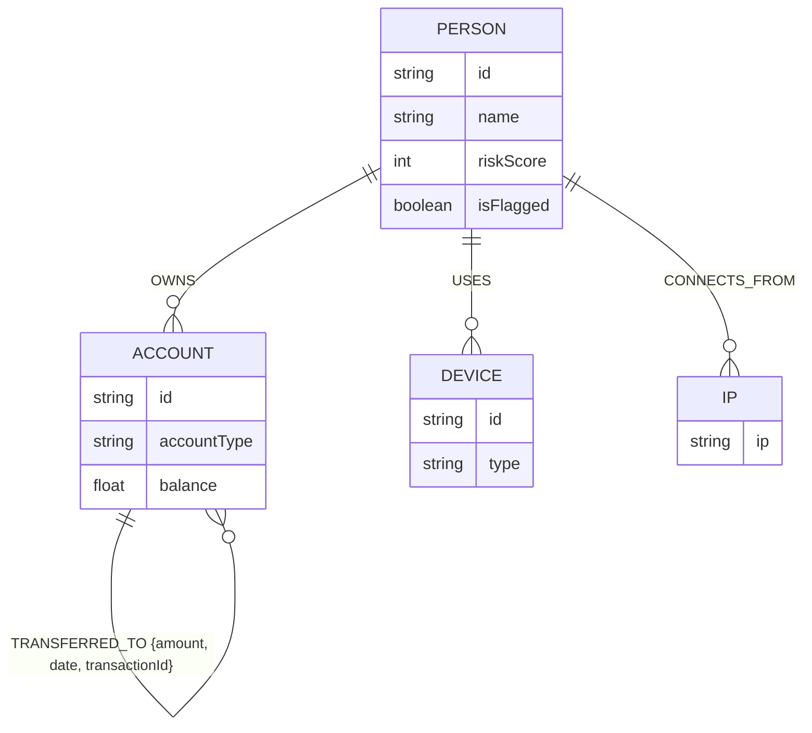
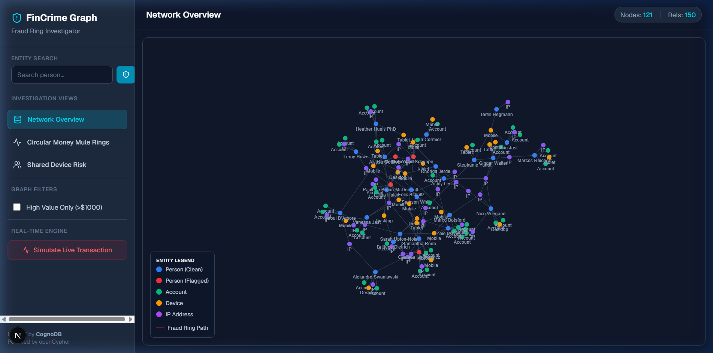
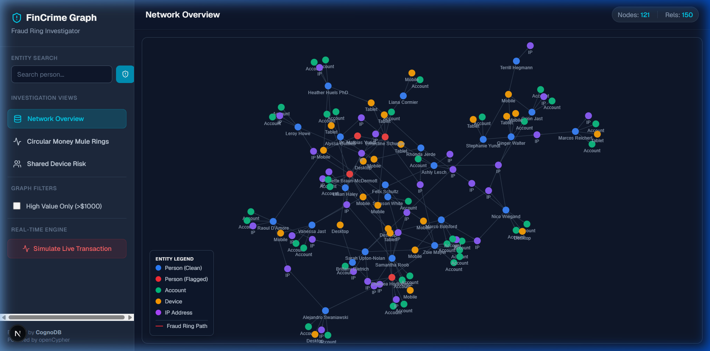
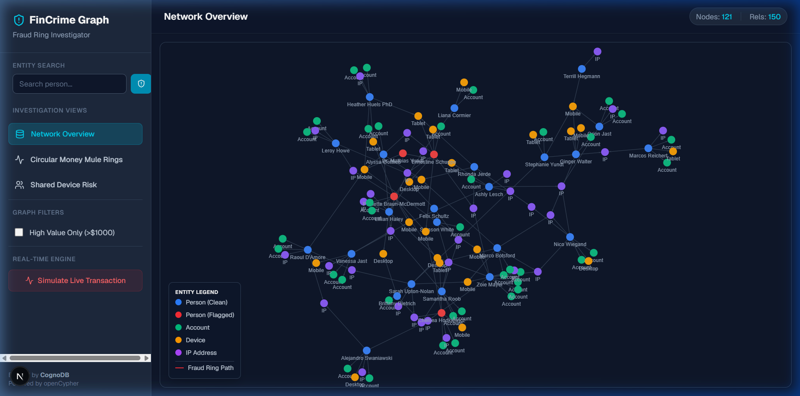

# FinCrime Graph Investigator (CognoDB Assignment)

Welcome to the FinCrime Graph Investigator! This is a functional web application built on top of **CognoDB** (a managed graph database using openCypher/Neo4j) to detect and investigate financial fraud rings.

## 🕵️ The Use Case: Financial Fraud Detection

In financial fraud, bad actors frequently attempt to obfuscate their tracks through complex, multi-layered activities:
- **Money Muling / Layering:** Transferring funds across multiple accounts in a circular or deep chain to hide the original source (A → B → C → D → A).
- **Identity Synthesis & Device Sharing:** Multiple fraudulent accounts operating from the same Device ID or IP Address.

### Why a Graph Database?
If we attempted to build this using a **Relational Database (SQL)**, answering questions like *"Find a cycle of money transfers spanning up to 5 accounts"* or *"Find all unflagged users who share an IP address with a flagged user"* would require incredibly complex, recursive, and slow `JOIN`s. 

A **Graph Database** treats these relationships as first-class citizens. By modeling our data as a graph, we can execute variable-length path queries and find deep, hidden connections in milliseconds using a few lines of Cypher.

---

## 🏗️ Data Model

Below is a simple diagram of the graph schema:



---

## 🚀 Setup & Run Instructions

### 1. Database Configuration
1. Create a free **(c0)** instance at [console.cognodb.com/signup](https://console.cognodb.com/signup).
2. Save your connection URI and password.

### 2. Environment Variables
Clone this repository, install dependencies, and create a `.env.local` file in the root directory:
```bash
npm install
```
```env
NEO4J_URI=bolt+s://<instance-id>.databases.cognodb.cloud
NEO4J_USERNAME=cognodb
NEO4J_PASSWORD=<your-password>
```

### 3. Seed the Database
Run the included seed script to generate interconnected financial data (includes injected fraud rings) using Faker.js:
```bash
node scripts/seed.mjs
```

### 4. Run Locally
Start the Next.js development server:
```bash
npm run dev
```
Open [http://localhost:3000](http://localhost:3000) to start investigating.

---

## 🔍 Main Cypher Queries Explained

All queries are parameterized and executed via the official `neo4j-driver` in `src/app/api/graph/route.ts`.

### 1. The Money Mule Ring (Multi-Hop Cycle)
**Goal:** Detect circular money transfers (A → B → C → A).
```cypher
MATCH path = (a:Account)-[r1:TRANSFERRED_TO]->(b:Account)-[r2:TRANSFERRED_TO]->(c:Account)-[r3:TRANSFERRED_TO]->(a)
RETURN nodes(path) as nodes, relationships(path) as rels
LIMIT 10
```
*Why Graph?* Finding cycles in a standard SQL database is notoriously difficult and computationally expensive. In Cypher, it is literally drawing a circle in ASCII art.

### 2. Shared Device Risk (2-Hop Traversal)
**Goal:** Find unflagged "clean" users who have logged in using the same device as a known flagged fraudster.
```cypher
MATCH (bad:Person {isFlagged: true})-[:USES]->(d:Device)<-[:USES]-(suspect:Person {isFlagged: false})
RETURN bad, d, suspect
```
*Why Graph?* This traverses `Person -> Device <- Person` effortlessly, instantly identifying suspect accounts for manual review.

### 3. Entity Blast Radius (Variable-Length Path)
**Goal:** When investigating a specific person, load their entire localized network (accounts, shared devices, shared IPs) up to 2 hops away.
```cypher
MATCH path = (p:Person {id: $personId})-[*1..2]-(m)
RETURN nodes(path) as nodes, relationships(path) as rels
```

---

## 🎨 Features & UI
- **Cyber-Security Aesthetic:** Professional Dark Navy & Neon Cyan dual-color UI.
- **Interactive Force Graph:** Built with `react-force-graph-2d`. Zoom, pan, and drag nodes to explore networks.
- **Real-Time Temporal Engine:** Simulates and detects live transactions and fraud rings.
- **Entity Inspector:** Click on any node to view detailed properties and load 2-hop localized network blasts.

---

## 📸 Demo & Screenshots

### Live Simulation Demo
<video src="./media/demo_video.mp4" controls="controls" muted="muted" width="100%"></video>

### Dashboard Overview


### Circular Money Mule Detection


### Shared Device Risk Analysis


---

### Live Demo URL
**[https://fincrime-graph.vercel.app](https://fincrime-graph.vercel.app)**
