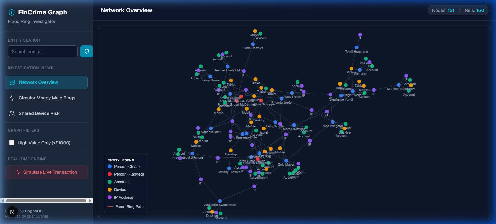
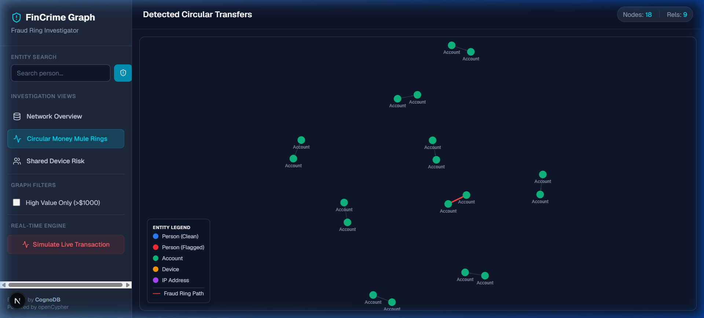
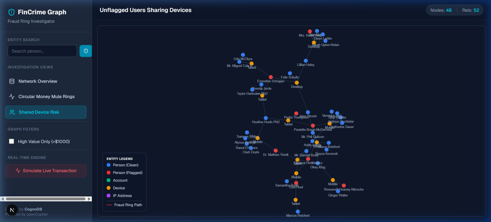

# FinCrime Graph Investigator

A modern, functional web application built to detect and investigate financial fraud rings using **CognoDB** (a managed Neo4j/openCypher graph database) and **Next.js**.

The application models financial entities (Persons, Accounts, Devices, IPs) as a graph to uncover complex money laundering operations, such as circular money mules and shared device risks, which are notoriously difficult to detect using traditional relational databases.

---

## 🎨 Features & UI
- **Cyber-Security Aesthetic:** Professional Dark Navy & Neon Cyan dual-color UI.
- **Interactive Force Graph:** Built with `react-force-graph-2d`. Zoom, pan, and drag nodes to explore networks.
- **Real-Time Temporal Engine:** Simulates and detects live transactions and fraud rings.
- **Entity Inspector:** Click on any node to view detailed properties and load 2-hop localized network blasts.

---

## 🚀 Setup & Run Instructions

### 1. Database Configuration
1. Create a free **(c0)** instance at [console.cognodb.com/signup](https://console.cognodb.com/signup).
2. Save your connection URI and password.

### 2. Environment Variables
Clone this repository, install dependencies, and create a `.env.local` file in the root directory:
```bash
npm install
```
```env
NEO4J_URI=bolt+s://<instance-id>.databases.cognodb.cloud
NEO4J_USERNAME=cognodb
NEO4J_PASSWORD=<your-password>
```

### 3. Seed the Database
Run the included seed script to generate interconnected financial data (includes injected fraud rings) using Faker.js:
```bash
node scripts/seed.mjs
```

### 4. Run Locally
Start the Next.js development server:
```bash
npm run dev
```
Open [http://localhost:3000](http://localhost:3000) to start investigating.

---

## 📸 Demo & Screenshots

### Live Simulation Demo


### Dashboard Overview


### Circular Money Mule Detection


### Shared Device Risk Analysis


---

### Live Demo URL
**[https://fincrime-graph.vercel.app](https://fincrime-graph.vercel.app)**
